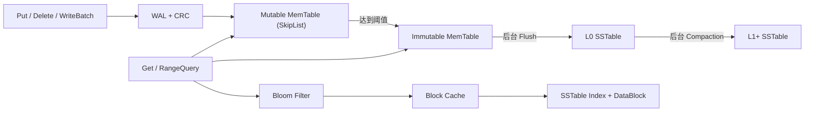

# mini-tsdb

> 基于 C++17 实现的轻量级时序存储引擎：LSM-tree 写入路径、WAL 持久化、SSTable 查询与后台 Compaction。

## 项目概览

`mini-tsdb` 面向 `(measurement, timestamp)` 时序键，聚焦存储引擎的核心读写路径与可靠性机制。项目以单机、单进程原型为定位，实现了从写入、持久化、查询到恢复和后台压缩的完整闭环。

## 架构



## 核心实现

- **可靠写入**：WAL 支持 CRC 校验、物理分片、截断恢复及同步/异步落盘；`WriteBatch` 将一次同步落盘覆盖多条逻辑写入。
- **LSM 写路径**：SkipList MemTable 满阈值后切换为 Immutable MemTable，由后台线程 Flush 为 SSTable，并提供写入背压控制。
- **读路径优化**：SSTable Sparse Index、Bloom Filter 负查询过滤与 LRU Block Cache；读路径使用 `shared_mutex` 支持并发读取。
- **存储维护**：后台 Leveled Compaction、Manifest/CURRENT 版本恢复、旧 SSTable 延迟清理、TTL 回收与降采样。

## 性能与质量验证

Linux Release 环境下，完整单元测试 **6,789 passed, 0 failed**；GitHub Actions 自动执行构建与 CTest。连续 3 轮基准平均结果如下：

| 场景 | 结果 |
|---|---:|
| 异步 WAL 顺序写 | 38.0w ops/s |
| 随机写 | 31.8w ops/s |
| 同步 WAL 批写（batch=100） | 14.9w ops/s |
| 点查延迟 | 26.45 us/op |
| 100 行范围查询 | 62.68 us/op |
| 4 线程并发点查 | 33.6w ops/s |
| WAL 回放 2 万条记录 | 0.020 s |

性能数据受硬件、磁盘与系统负载影响，主要用于版本验证与趋势对比。

## 构建与运行

```bash
cmake -S . -B build -DCMAKE_BUILD_TYPE=Release
cmake --build build --parallel
cd build && ctest --output-on-failure
```

```bash
./build/sensor_demo
./build/observability_demo
./build/minitsdb_bench
```

## 目录结构

```text
src/      核心存储引擎
tests/    单元测试与 smoke test
bench/    性能基准
demo/     传感器与可观测性示例
```

## 项目边界

当前版本专注于单机时序存储引擎的核心机制验证；未实现分布式复制、事务快照和生产级多写者调度。
