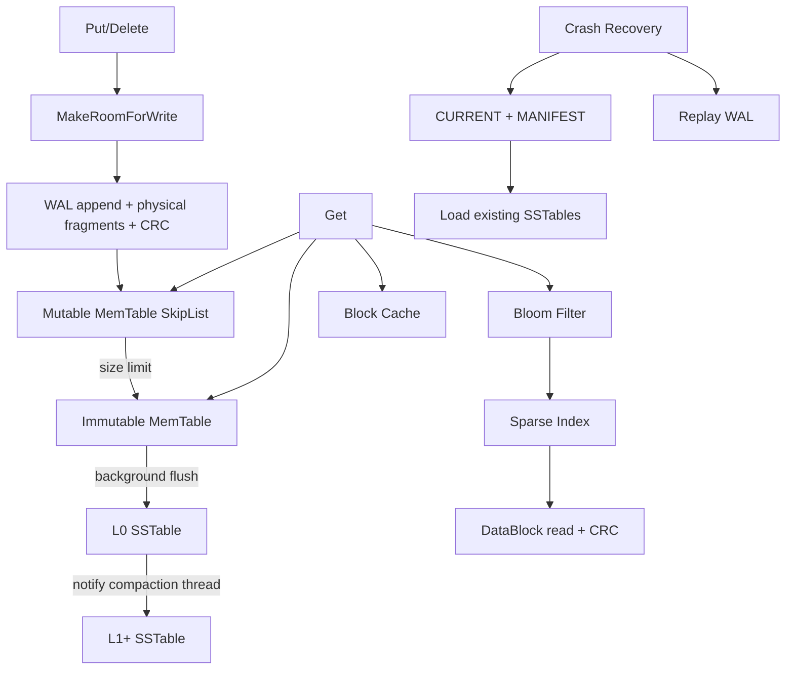

# mini-tsdb / mini-LevelDB

一个用 C++17 实现的教学版 mini-LevelDB / mini-TSDB。项目采用 LSM-tree 思路，面向时序 key：

```text
key   = (measurement: string, timestamp: int64)
value = string
order = measurement 字典序 + timestamp 升序
```

项目目标不是复刻完整工业级 LevelDB/RocksDB，而是把写路径、读路径、WAL、MemTable、SSTable、Bloom Filter、Compaction 和恢复链路做成可运行、可测试、可讲解的闭环。

## 已实现能力

| 模块 | 状态 | 说明 |
|---|---|---|
| Put | 已实现 | 先写 WAL，再写 MemTable |
| Get | 已实现 | MemTable -> Immutable MemTable -> SSTable |
| Delete / tombstone | 已实现 | Delete 写入 tombstone，贯穿 WAL、MemTable、SSTable、Compaction |
| RangeQuery | 已实现 | 按 measurement + 时间范围扫描 |
| WAL | 已实现 | Put/Delete 逻辑记录、CRC32、Replay、尾部截断恢复、物理日志分片 |
| sync/buffered WAL | 已实现 | `sync_wal=true` 每条写强制刷盘；`false` 用于高吞吐 benchmark |
| WriteBatch | 已实现 | 批量写入多条 Put/Delete，sync WAL 模式下一批只做一次 WAL sync |
| MemTable | 已实现 | SkipList + `std::shared_mutex` |
| Immutable MemTable | 已实现 | MemTable 写满后切换，后台 flush |
| MakeRoomForWrite | 已实现 | flush 跟不上时写线程等待，避免 mutable MemTable 无限膨胀 |
| SSTable | 已实现 | DataBlock、Sparse Index、BloomBlock、Footer |
| Sparse Index | 已实现 | 每个 DataBlock 记录 `last_key / offset / size` |
| Bloom Filter | 已实现 | SSTable 点查前先过滤不存在 key |
| Block Cache | 已实现 | LRU 缓存 SSTable DataBlock payload，首次读仍做 CRC 校验 |
| Leveled Compaction | 简化实现 | 独立 `CompactionThread`，L0 -> L1，输入快照、锁外合并、锁内提交 |
| Manifest / CURRENT | 已实现 | 文本 Manifest 持久化版本视图，缺失时 fallback 目录扫描 |
| Crash Recovery | 已实现 | 启动加载 SSTable，再 replay WAL |
| CRC 校验 | 已实现 | WAL physical record 和 SSTable DataBlock 均有 CRC32 |
| Obsolete 文件清理 | 已实现 | Compaction 更新版本视图后，旧 reader 进入 `pending_delete_`，无读者引用后再删除 |
| TTL / Downsample | 已实现 | 查询时过滤过期数据；Compaction 可物理回收过期记录；范围查询后本地聚合 |
| Compaction 输出切分 | 已实现 | 支持 `target_file_size`，大 compaction 可输出多个 SSTable |
| 可观测场景 Demo | 已实现 | 模拟推理中间件 QPS、队列、TTFT/TPOT、GPU 显存指标写入和查询 |
| Benchmark | 已实现 | 写吞吐、批写、读延迟、Bloom 参数、Block Cache、Compaction、WAL recovery |

## 架构



## WAL 格式

当前 WAL 分为两层：外层是物理 record，内层是逻辑 payload。

物理 record：

```text
crc32(4B)
fragment_len(4B)
physical_type(1B)      // 1=Full, 2=First, 3=Middle, 4=Last
fragment_payload(bytes)
```

逻辑 payload：

```text
logical_type(1B)       // 1=Put, 2=Delete
measurement_len(4B)
timestamp(8B)
measurement(bytes)
value(bytes)
```

小记录使用 `Full`；大 value 会被拆成 `First / Middle / Last` 多个物理 record。Replay 时先校验每个物理 record 的 CRC，再拼回完整逻辑 payload。若尾部 fragment 不完整，只丢弃最后一条未完成逻辑记录。

当前项目的 WAL 文件命名仍是教学版简化：

```text
db_dir/
├── wal.log      # 当前 WAL
└── wal.log.old  # Rotate 后的上一个 WAL
```

没有实现真实 LevelDB 的多编号 WAL 文件和 Manifest log number 管理。

## SSTable 格式

```text
SSTable
├── DataBlock 0
│   ├── crc32(block_payload)  4B
│   └── entries...
├── DataBlock 1
│   ├── crc32(block_payload)  4B
│   └── entries...
├── IndexBlock
├── BloomBlock
└── Footer
```

DataBlock entry：

```text
key_len(varint)
key_bytes:
  measurement_len(varint)
  measurement(bytes)
  timestamp(8B little-endian)
entry_type(1B)       // 1=value, 2=deletion tombstone
value_len(varint)
value(bytes)
```

IndexBlock：

```text
num_blocks(varint)
repeated:
  last_key_len(varint)
  last_key(bytes)
  block_offset(8B)
  block_size(8B)
```

Footer：

```text
index_offset(8B)
bloom_offset(8B)
magic(8B)            // S_MINI02
```

## 与 LevelDB / RocksDB 的差异

| 维度 | mini-tsdb | LevelDB / RocksDB |
|---|---|---|
| Key 模型 | 时序 key `(measurement,timestamp)` | 通用 byte key/value + comparator |
| WAL | 单 `wal.log` + `wal.log.old`，支持物理分片、CRC、replay、WriteBatch 一次 sync | 多编号 log 文件、sequence、WriteBatch、writer queue、复杂恢复 |
| MemTable | SkipList + 读写锁 | SkipList/Vector/HashSkipList，可配 Arena、写队列等 |
| MakeRoomForWrite | 简化 backpressure，flush 跟不上时等待 | 更完整的 writer queue、L0 slowdown/stop、group commit |
| SSTable | 简化 block + index + bloom + footer | restart points、filter block、metaindex、compression、cache |
| Version | 文本 Manifest/CURRENT + fallback 目录扫描 | 完整 MANIFEST log、VersionSet、log number 管理 |
| Compaction | 独立后台线程，输入快照、锁外合并、锁内原子发布 Version + reader，支持 file_size、TTL 回收、输出切分 | picker、trivial move、grandparent overlap、snapshot 语义、多后台队列 |
| Delete | tombstone 保守保留；TTL 过期记录可在 compaction 中回收 | tombstone + sequence + snapshot + bottommost GC |
| Snapshot | 未实现 | 已实现 |
| Cache | 简化 Block Cache | block cache/table cache/write buffer manager |

## 构建

```bash
cmake -S . -B build -DCMAKE_BUILD_TYPE=Release
cmake --build build --parallel
```

## 测试、Demo、Benchmark

```bash
./build/minitsdb_test
./build/sensor_demo
./build/observability_demo
./build/minitsdb_bench
```

当前完整测试覆盖：

- WAL replay
- WAL 尾部截断恢复
- WAL Put/Delete replay
- WAL 物理日志分片 replay
- WAL 分片尾部截断恢复
- SSTable DataBlock CRC
- flush/restart
- MakeRoomForWrite backpressure
- WriteBatch crash recovery
- Delete/tombstone 在 MemTable、SSTable、Recovery、Compaction 中的语义
- Compaction 版本视图
- 后台 Compaction 发布 reader 后可读
- Compaction/清理期间并发读 reader 生命周期安全
- Manifest 重启恢复 compaction 后版本视图
- Block Cache 热点查询命中
- TTL compaction 物理回收
- Compaction 输出文件切分
- obsolete SSTable 清理
- TTL / Downsample

最近一次验证：

```text
minitsdb_test.exe
6770 passed, 0 failed

sensor_demo.exe
正常完成写入、点查、范围查询和降采样演示

observability_demo.exe
正常完成可观测指标写入、范围查询、降采样和重启恢复演示
```

## Benchmark 说明

README 中的 benchmark 数据必须带测试条件：Windows / MSVC Release，`buffered WAL` 表示 `sync_wal=false`，不对每条 WAL 写执行 `_commit/fsync`；`sync WAL` 表示每条写都强制刷盘。

历史示例数据：

```text
sequential write buffered WAL              50000 ops, 299208 ops/s
sequential write sync WAL                   1000 ops, 48 ops/s
random write buffered WAL                  50000 ops, 247091 ops/s
point get                                    avg 16.37 us/op
range query 100 rows                         avg 63.53 us/op
negative get with bloom                      300 candidates, 1 DataBlock read
compaction files                             before 3 SST, after 1 SST
WAL recovery                                 20000 records replayed in 0.015s
```

最近一次本机 Release 示例数据：

```text
sequential write buffered WAL              50000 ops, 206484 ops/s
sequential write sync WAL                   1000 ops, 40 ops/s
write batch sync WAL size=10                1000 ops, 412 ops/s
write batch sync WAL size=100               1000 ops, 3058 ops/s
random write buffered WAL                  50000 ops, 166174 ops/s
point get                                    avg 16.36 us/op
range query 100 rows                         avg 34.48 us/op
bloom bits_per_key=4/8/10/14                 false positive: 228/11/6/0 of 5000
compaction files                             before_bytes=190334, after_bytes=64778
hot range query with block cache             hits=3996, misses=4
WAL recovery                                 20000 records replayed in 0.017s
```

2026-07-02 本机 Release 三次复测记录：

| 指标 | Run 1 | Run 2 | Run 3 | 参考范围 |
|---|---:|---:|---:|---|
| buffered 顺序写 | 19.98w ops/s | 25.56w ops/s | 21.89w ops/s | 16w-25w ops/s |
| 随机写 | 17.33w ops/s | 16.26w ops/s | 18.23w ops/s | 12w-18w ops/s |
| sync WAL 单条写 | 43 ops/s | 43 ops/s | 39 ops/s | 约 30-40 ops/s |
| WriteBatch(batch=100) | 3314 ops/s | 3799 ops/s | 3852 ops/s | 约 1800-3800 ops/s |
| 点查 | 11.18 us/op | 14.68 us/op | 12.36 us/op | 10-20 us/op |
| 100 行范围查询 | 24.65 us/op | 26.77 us/op | 26.03 us/op | 25-50 us/op |
| WAL 恢复 2w 条 | 0.018s | 0.021s | 0.019s | 0.02-0.03s |
| Compaction 空间收敛 | 190334 -> 64778 bytes | 190334 -> 64778 bytes | 190334 -> 64778 bytes | 约 190KB -> 65KB |
| 单元测试 | 5804 passed, 0 failed | 5804 passed, 0 failed | 5804 passed, 0 failed | 当前新增后台 compaction 并发测试后，单次验证 6770 passed, 0 failed |

不要把 buffered WAL 和 sync WAL 简单写成“优化了几千倍”。更准确的说法是：它们代表不同可靠性边界下的写入模式。

## 学习主线

```text
Put / Get / Delete
WAL physical fragments + logical Put/Delete
sync WAL / buffered WAL
MemTable / Immutable MemTable
MakeRoomForWrite backpressure
SSTable
Sparse Index
Bloom Filter
Leveled Compaction
Crash Recovery
Benchmark / Fault Tests
Observability Demo / WriteBatch / Manifest / Block Cache
```
